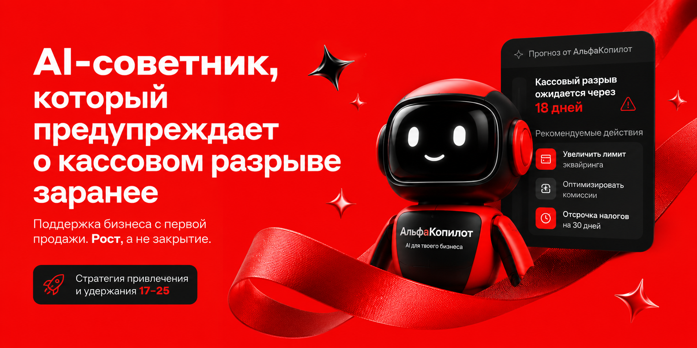
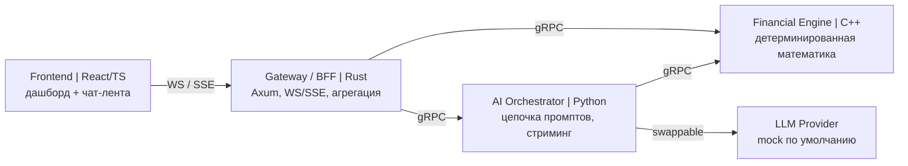
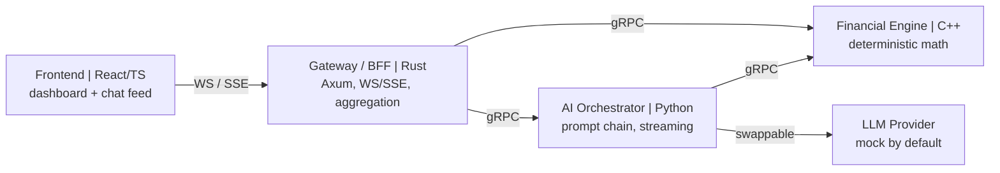

<div align="center">



# АльфаКопилот | AlfaCopilot

**AI-советник, который замечает кассовый разрыв за 2-3 недели до того, как он случится.**
**An AI advisor that spots a cash-flow gap 2-3 weeks before it happens.**


### **[Русский](#-русская-версия)  |  [English](#-english-version)**

</div>

---

## <a id="-русская-версия"></a> Русская версия

> Читать на другом языке: **[English](#-english-version)**

### Оглавление
- [Проблема](#проблема)
- [Инсайт](#инсайт)
- [Решение](#решение)
- [Как это работает](#как-это-работает)
- [Демо-сценарий: Марина](#демо-сценарий-марина)
- [Почему это сильное решение](#почему-это-сильное-решение)
- [Архитектура](#архитектура)
- [Технологический стек](#технологический-стек)
- [Быстрый старт](#быстрый-старт)
- [Структура проекта](#структура-проекта)
- [Разработка](#разработка)
- [Эффект для банка](#эффект-для-банка)

### Проблема

Платежный бизнес Альфа-Банка охватывает молодых предпринимателей 17-25 лет недостаточно:
средний возраст действующего клиента - 42 года. Значимая причина потери клиентов в этом
сегменте - не переход к конкуренту, а закрытие бизнеса. А главная причина закрытия -
нехватка знаний и опыта, а не денег. Обычный банк замечает проблему клиента только тогда,
когда баланс уже ушел в минус - то есть слишком поздно.

### Инсайт

Банк должен входить в жизнь предпринимателя с первой продажи, а не когда у него уже есть
оборот. Данные эквайринга появляются у банка раньше, чем проблема становится очевидной
самому предпринимателю. Значит, банк может предупредить, а не констатировать.

### Решение

**АльфаКопилот** - AI-советник внутри сервиса "АльфаЗапуск". Он читает реальные данные
эквайринга, за 2-3 недели до кассового разрыва предупреждает о нем и предлагает конкретную
поддержку через продукты Платежного бизнеса: рассрочку "Подели" на оборудование, сервис
чаевых "Нет монет" для допдохода, гибкие тарифы эквайринга.

Это не отчет и не дашборд с цифрами. Это проактивное человеческое сообщение с планом
действий - то, что предприниматель реально увидит в приложении.

### Как это работает

Пять последовательных шагов AI-цепочки. Каждый шаг появляется на экране по мере готовности -
жюри и пользователь видят работающий пайплайн, а не готовую картинку.

1. **Диагностика** - метрики из сырых транзакций: средний чек, частота операций, тренд по
   неделям, буфер налички в днях. Считает детерминированный движок на C++.
2. **Прогноз кассового разрыва** - через сколько дней баланс уйдет в критическую зону, с
   уровнем уверенности.
3. **Классификация риска** - статус зеленый / желтый / красный с обоснованием.
4. **Рекомендация** - 2-3 конкретных действия, привязанных к продуктам банка, а не общие
   советы вроде "снизьте расходы".
5. **Проактивное сообщение** - финальный текст от лица АльфаКопилота с одним призывом к
   действию.

### Демо-сценарий: Марина

Марина, 22 года, мастер маникюра из Казани, самозанятая. Принимает оплату через mPOS и
QR-СБП. Первые два месяца доход растет. На третьем - сезонный спад и крупный разовый расход
на оборудование. Баланс приближается к критическому уровню, но еще не отрицательный.

Обычный банк заметил бы проблему по факту. АльфаКопилот замечает тревожный тренд раньше и
предлагает: перевести часть расходов на "Подели", включить "Нет монет" для допдохода с
чаевых, запустить короткую акцию на провальные дни недели.

### Почему это сильное решение

- **Проактивность, а не констатация.** Предупреждаем за 2-3 недели, а не показываем минус
  по факту.
- **Реальный пайплайн, а не мокап.** Четыре микросервиса, gRPC между ними, стриминг в
  браузер. Техническая глубина видна на защите.
- **Привязка к продуктам банка.** Каждая рекомендация ведет в конкретный продукт Платежного
  бизнеса - решение работает на выручку, а не только на лояльность.
- **Работа на удержание.** Бьем в настоящую причину оттока - закрытие бизнеса из-за нехватки
  знаний, - а не боремся за переток между банками.
- **Детерминированность.** Фиксированный seed данных и mock-провайдер LLM: демо повторяемо и
  запускается без единого платного ключа.
- **Осмысленный ИИ.** ИИ встроен в путь предпринимателя и решает конкретную боль, а не
  добавлен ради галочки.

### Архитектура

Четыре сервиса, каждый на своем языке по делу. Внутри - gRPC, наружу к браузеру - WebSocket
или SSE. Контракты (protobuf) заморожены в общей папке `proto/` и разрабатываются параллельно
против моков.



| Сервис | Язык | Роль |
|---|---|---|
| Financial Engine | C++ | Детерминированная диагностика и числовой прогноз по транзакциям. |
| AI Orchestrator | Python | Владеет цепочкой промптов, вызывает LLM через сменный провайдер, стримит шаги. |
| Gateway / BFF | Rust | Единая точка входа, агрегирует gRPC, отдает WS/SSE, health-checks. |
| Frontend | React/TS | Дашборд баланса и чат-лента АльфаКопилота. |

### Технологический стек

- **Frontend:** React, TypeScript, Vite, архитектура Feature-Sliced Design (импорт только
  вниз, см. `docs/frontend.md`).
- **Gateway:** Rust, Axum/Actix, gRPC, WebSocket/SSE.
- **AI Orchestrator:** Python, gRPC, сменный `LlmProvider` (mock / OpenAI-совместимый /
  Ollama / Anthropic).
- **Financial Engine:** C++20, детерминированная математика, gRPC.
- **Инфраструктура:** Docker Compose, общие protobuf-контракты, `justfile`, GitHub Actions.

### Быстрый старт

```bash
git clone <repo-url>
cd alfa-copilot
cp .env.example .env
docker compose up
```

По умолчанию `LLM_PROVIDER=mock` - демо работает без платного API-ключа и дает одинаковый
результат при каждом запуске. Чтобы подключить реальный LLM, задайте `LLM_PROVIDER` и ключ
в `.env`.

Фронтенд поднимется на `http://localhost:5173`, шлюз - на `http://localhost:8080`.

### Структура проекта

```
proto/                      общие gRPC-контракты (единый источник правды)
services/financial-engine/  C++: диагностика и прогноз
services/ai-orchestrator/   Python: цепочка промптов, провайдеры LLM
services/gateway/           Rust: BFF, WS/SSE
frontend/                   React/TS: дашборд и чат (Feature-Sliced Design)
docs/                       контекст кейса, ТЗ, документация фронтенда
```

### Разработка

Все проверки собраны в `justfile` в двух режимах.

```bash
just hooks     # один раз после клона: включить общий pre-commit хук
just fmt       # отформатировать все языки
just check     # быстрый прекоммит-гейт: формат + линтеры, без тестов
just ci        # жесткий гейт: строгие линтеры + типы + все тесты
```

Правила: максимальная строгость (ноль варнингов), запрет комментариев в коде, говорящие
имена, строгая типизация, разработка через тесты (TDD). Полный свод - в `CLAUDE.md`.

### Эффект для банка

- **Раннее привлечение.** Банк полезен с первой продажи, а не после выхода на оборот.
- **Удержание.** Прямая работа с настоящей причиной оттока - закрытием бизнеса.
- **Рост выручки.** Рекомендации ведут в конкретные продукты Платежного бизнеса.
- **Долгосрочная позиция.** Банк становится партнером растущего бизнеса, а не разовым
  инструментом.

---

## <a id="-english-version"></a> English version

> Read in another language: **[Русский](#-русская-версия)**

### Table of contents
- [The problem](#the-problem)
- [The insight](#the-insight)
- [The solution](#the-solution)
- [How it works](#how-it-works)
- [Demo scenario: Marina](#demo-scenario-marina)
- [Why this is a strong solution](#why-this-is-a-strong-solution)
- [Architecture](#architecture)
- [Tech stack](#tech-stack)
- [Quick start](#quick-start)
- [Project structure](#project-structure)
- [Development](#development)
- [Impact for the bank](#impact-for-the-bank)

### The problem

Alfa-Bank's Payment business under-serves young entrepreneurs aged 17-25: the average active
client is 42. A major cause of churn in this segment is not switching to a competitor but the
business closing down. And the main reason businesses close is a lack of knowledge and
experience, not money. A regular bank notices the problem only once the balance is already
negative - too late.

### The insight

The bank should enter the entrepreneur's journey at the first sale, not once there is
turnover. Acquiring data reaches the bank earlier than the problem becomes obvious to the
entrepreneur. So the bank can warn, not just report.

### The solution

**AlfaCopilot** is an AI advisor inside the "AlfaLaunch" service. It reads real acquiring
data, warns about a cash-flow gap 2-3 weeks ahead, and offers concrete support through
Payment-business products: "Podeli" installments for equipment, the "Net Monet" tipping
service for extra income, flexible acquiring rates.

It is not a report or a dashboard of numbers. It is a proactive, human message with a plan of
action - what the entrepreneur actually sees in the app.

### How it works

A chain of five sequential AI steps. Each step appears on screen as it completes - the judges
and the user see a working pipeline, not a finished picture.

1. **Diagnostics** - metrics from raw transactions: average check, operation frequency, weekly
   trend, cash buffer in days. Computed by a deterministic C++ engine.
2. **Cash-gap forecast** - how many days until the balance enters the critical zone, with a
   confidence level.
3. **Risk classification** - green / yellow / red status with a one-sentence rationale.
4. **Recommendation** - 2-3 concrete actions tied to bank products, not generic advice like
   "cut your costs".
5. **Proactive message** - a final message from AlfaCopilot with a single call to action.

### Demo scenario: Marina

Marina, 22, a nail artist from Kazan, self-employed. She takes payments via mPOS and QR-SBP.
Income grows for the first two months. In the third comes a seasonal dip plus a large one-off
equipment purchase. The balance approaches a critical level but is not yet negative.

A regular bank would notice the problem after the fact. AlfaCopilot spots the worrying trend
earlier and proposes: move part of the spend to "Podeli", switch on "Net Monet" for extra tip
income, run a short promo on weak weekdays.

### Why this is a strong solution

- **Proactive, not reactive.** We warn 2-3 weeks ahead instead of showing a negative balance
  after the fact.
- **A real pipeline, not a mockup.** Four microservices, gRPC between them, streaming to the
  browser. The technical depth is visible in the defense.
- **Tied to bank products.** Every recommendation leads into a specific Payment-business
  product - the solution works on revenue, not only loyalty.
- **Built for retention.** It targets the real cause of churn - businesses closing from a lack
  of knowledge - rather than fighting over customers between banks.
- **Deterministic.** A fixed data seed and a mock LLM provider make the demo reproducible and
  runnable without a single paid key.
- **Meaningful AI.** The AI is embedded in the entrepreneur's journey and solves a concrete
  pain, not bolted on for show.

### Architecture

Four services, each in the language that fits its job. gRPC internally, WebSocket or SSE out
to the browser. The protobuf contracts are frozen in a shared `proto/` directory and developed
in parallel against mocks.



| Service | Language | Role |
|---|---|---|
| Financial Engine | C++ | Deterministic diagnostics and numeric forecast from transactions. |
| AI Orchestrator | Python | Owns the prompt chain, calls an LLM via a swappable provider, streams steps. |
| Gateway / BFF | Rust | Single entry point, aggregates gRPC, serves WS/SSE, health checks. |
| Frontend | React/TS | Balance dashboard and the AlfaCopilot chat feed. |

### Tech stack

- **Frontend:** React, TypeScript, Vite, Feature-Sliced Design (imports flow down only, see
  `docs/frontend.md`).
- **Gateway:** Rust, Axum/Actix, gRPC, WebSocket/SSE.
- **AI Orchestrator:** Python, gRPC, a swappable `LlmProvider` (mock / OpenAI-compatible /
  Ollama / Anthropic).
- **Financial Engine:** C++20, deterministic math, gRPC.
- **Infrastructure:** Docker Compose, shared protobuf contracts, `justfile`, GitHub Actions.

### Quick start

```bash
git clone <repo-url>
cd alfa-copilot
cp .env.example .env
docker compose up
```

By default `LLM_PROVIDER=mock` - the demo runs without a paid API key and returns the same
result on every run. To use a real LLM, set `LLM_PROVIDER` and the key in `.env`.

The frontend comes up on `http://localhost:5173`, the gateway on `http://localhost:8080`.

### Project structure

```
proto/                      shared gRPC contracts (single source of truth)
services/financial-engine/  C++: diagnostics and forecast
services/ai-orchestrator/   Python: prompt chain, LLM providers
services/gateway/           Rust: BFF, WS/SSE
frontend/                   React/TS: dashboard and chat (Feature-Sliced Design)
docs/                       case context, spec, frontend documentation
```

### Development

All checks live in the `justfile` in two tiers.

```bash
just hooks     # once after clone: enable the shared pre-commit hook
just fmt       # format every language
just check     # fast pre-commit gate: format + linters, no tests
just ci        # hard gate: strict linters + types + all tests
```

Rules: maximum strictness (zero warnings), no comments in code, speaking names, strong typing,
test-driven development. The full set is in `CLAUDE.md`.

### Impact for the bank

- **Early acquisition.** The bank is useful from the first sale, not after turnover appears.
- **Retention.** Direct work on the real cause of churn - businesses closing.
- **Revenue growth.** Recommendations lead into specific Payment-business products.
- **Long-term position.** The bank becomes a partner to a growing business, not a one-off tool.

---

<div align="center">

Сделано для чемпионата "Альфа-Будущее" 2026 | Built for the "Alfa Future" 2026 championship

</div>
